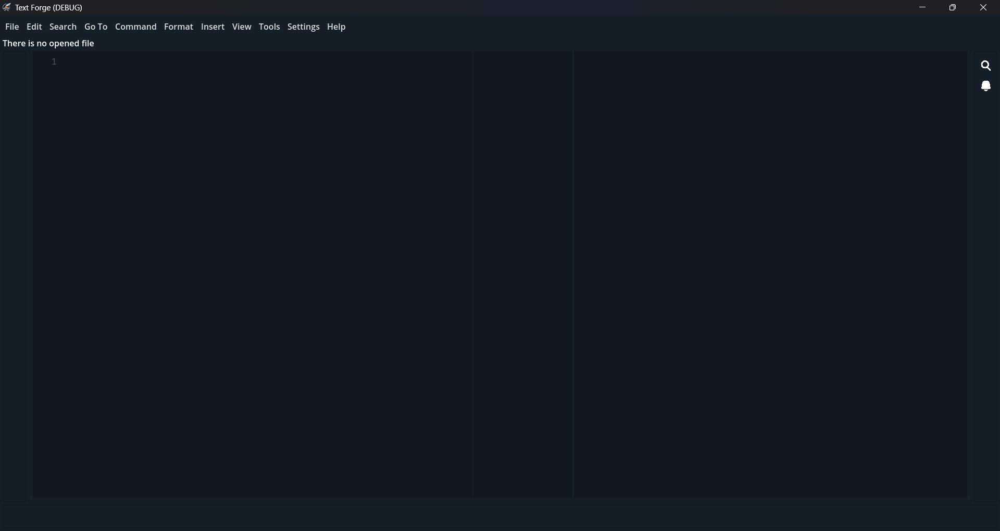

# Setup

Text Forge currently supports Linux and Windows (You can use it on other platforms with build it from source), Just download [latest](https://github.com/text-forge/text-forge/releases/latest) and install it! (or download portable version and extract it anywhere you want)

Now you can run Text Forge:

There is just one step to complete setup: [Install Modes](modes.md)